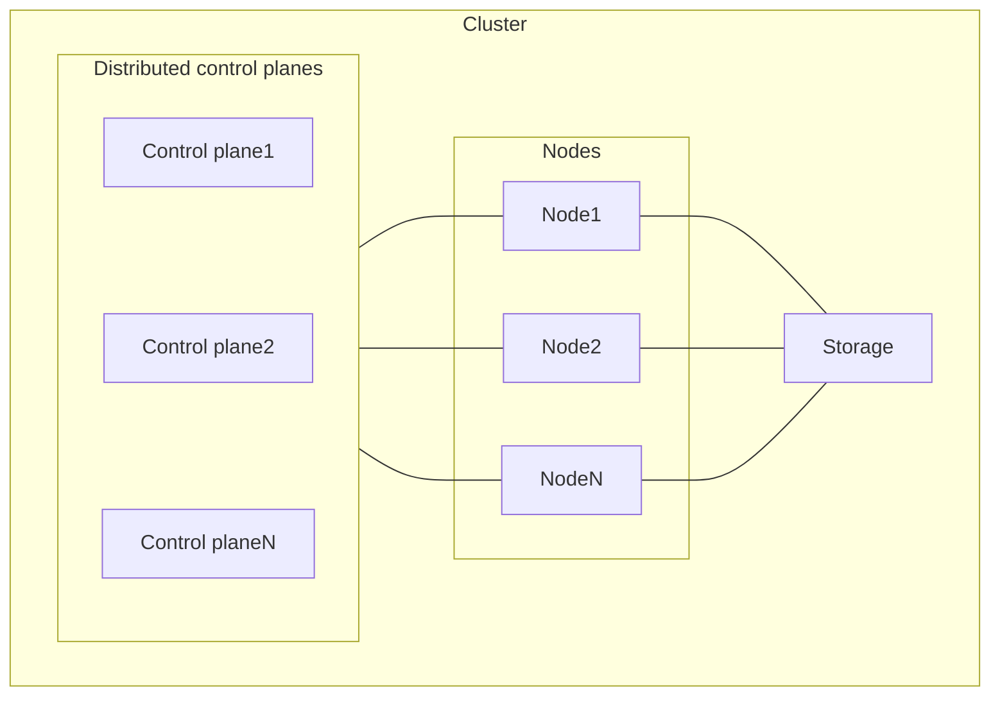
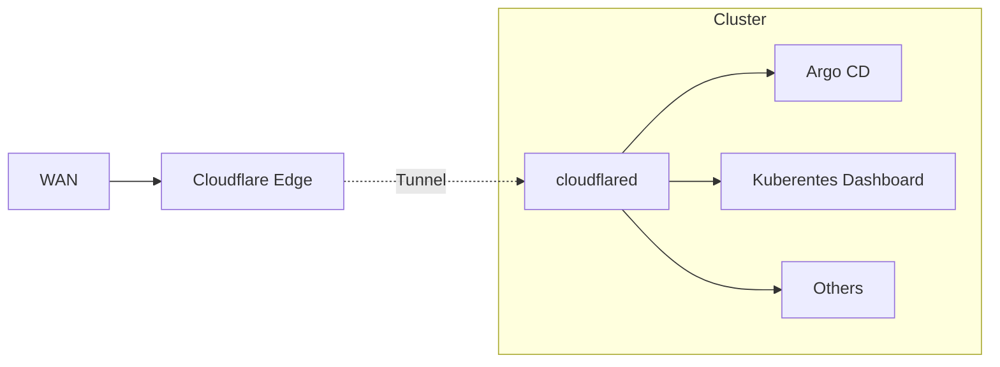

# Kubernetes cluster

## Architecture

The Kubernetes cluster at home is a cluster with multiple devices.    
See [Networks](/docs/networks/index.md) for the home network to which the cluster is connected.

### Access from WAN

To access the various applications in the cluster from WAN, use the [Cloudflare Tunnel](https://www.cloudflare.com/products/tunnel/).  
The Tunnel enables access from WAN without having to publish the server.  
It is also useful because authentication can be set up for access using Tunnel.

## Setup

[Set up the kubernetes cluster](/docs/kubernetes/setup.md)

## Upgrade

https://kubernetes.io/docs/tasks/administer-cluster/kubeadm/kubeadm-upgrade/
