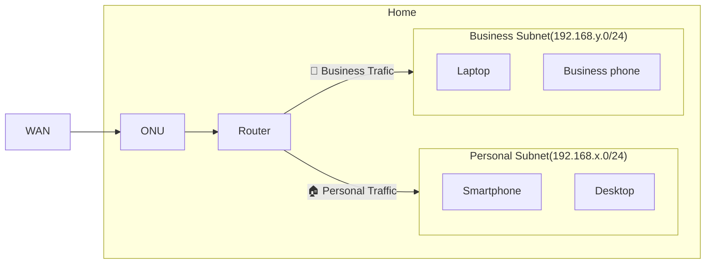
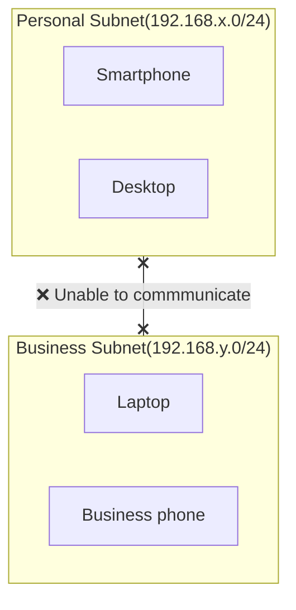
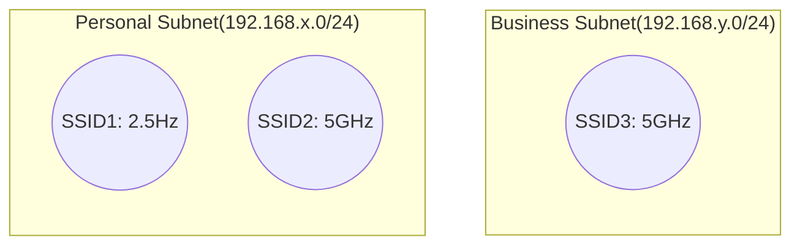

# Network devices

## Architecture

I have set up a home network using VLANs to separate personal and business subnets.  

### Communication between subnets

Although not shown in the figure, communication is not allowed between each subnet.

### Wireless router

The wireless router uses tag VLANs so that SSIDs 1 and 2 are assigned to the Personal subnet and SSID3 is assigned to the Business subnet.

## Setup

[Set up network devices](/docs/networks/setup.md)
