# Network devices

## Architecture

The home network uses VLANs to separate personal and business subnets.

```mermaid
graph LR

%% Definitions
WAN
subgraph Home
    ONU
    Router
    subgraph Personal["Personal Subnet(192.168.x.0/24)"]
        Smartphone
        Desktop
    end
    subgraph Business["Business Subnet(192.168.y.0/24)"]
        Laptop
        BSmartphone["Business phone"]
    end
end

%% Relations
WAN --> ONU
ONU --> Router
%% Personal
Router -->|"🏠 Personal Traffic"| Personal
%% Business
Router -->|"🏢 Business Traffic"| Business
```

### Communication between subnets

Communication is not allowed between subnets.

```mermaid
graph TB

%% Definitions
subgraph Personal["Personal Subnet(192.168.x.0/24)"]
    Smartphone
    Desktop
end
subgraph Business["Business Subnet(192.168.y.0/24)"]
    Laptop
    BSmartphone["Business phone"]
end

%% Relations
Personal x--x|"❌ Unable to communicate"| Business
```

### Wireless router

The wireless router uses tag VLANs to assign SSIDs 1 and 2 to the Personal subnet and SSID3 to the Business subnet.

## Setup

[Set up network devices](/docs/networks/setup.md)
