# Network devices

## Architecture

I have set up a home network using VLANs to separate personal and business subnets.  
Although not shown in the figure, communication is not allowed between each subnet.

```mermaid
graph LR

%% Definitions
WAN
subgraph Home
    direction RL

    ONU
    Router

    subgraph Personal["Personal Subnet(192.168.x.0/24)"]
        direction TB
        Smartphone
        Laptop
    end
    subgraph Business["Business Subnet(192.168.y.0/24)"]
        direction TB
        BSmartphone[Smartphone for business]
        BLaptop[Laptop for business]
    end
end

%% Relations
WAN ---> ONU
ONU --> Router
%% Personal
Router -->|"🏠 Personal Traffic"| Personal
Smartphone ~~~ Laptop
%% Business
Router -->|"🏢 Business Trafic"| Business
BSmartphone ~~~ BLaptop
```

## Setup

[Set up network devices](/docs/networks/setup.md)
