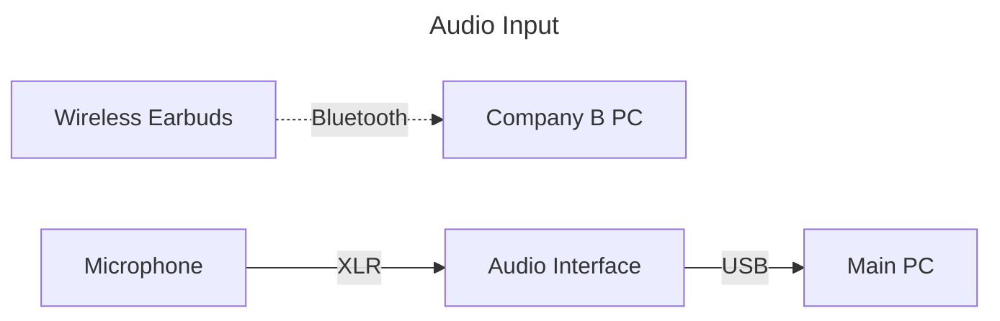
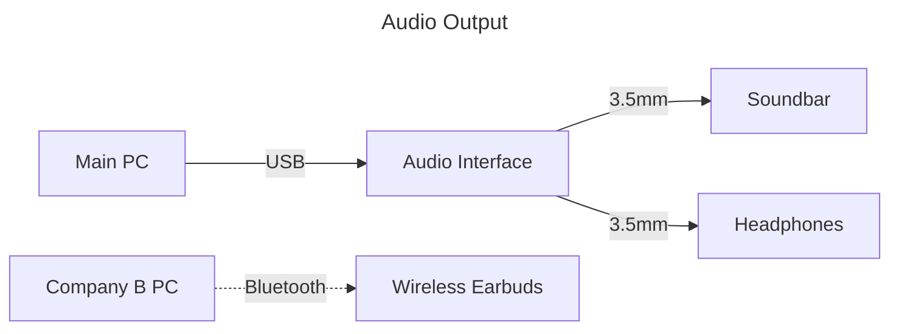
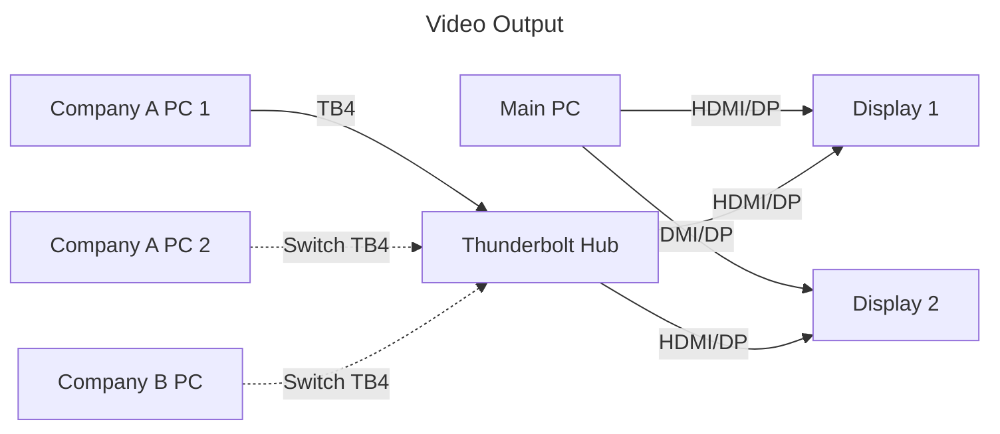

# Peripheral Device Management

## Home Office

This desk setup handles both remote work and personal activities.  
Work and personal peripherals are kept separate to avoid interference.

For network separation details, see [Network Devices](/docs/networks/index.md).







### Home Office Devices

- Computers
  - Private Main PC (for gaming and heavy processing)
  - Mac mini (Company A)
  - Windows Laptop PC (with GPU, for Company A game development and debugging)
  - MacBook Pro (Company B)
- Audio Equipment
  - Audio Interface/Mixer (AG06 Mk2)
  - Microphone (Shure, input to AG06)
  - Soundbar (output from AG06)
  - Headphones (output from AG06)
  - Wireless Earbuds (for calls on Company B Mac)
- Video Equipment
  - WQHD Displays x2
- Hubs
  - Thunderbolt 4 Hub (TS4, for switching video outputs between Company B and Company A)

## Mobile Setup

This setup covers co-working spaces and office visits.  
It's designed to be portable while maintaining essential work functionality.

```mermaid
graph LR
```

### Mobile Setup Devices

-
