# Set up my home devices

## Network architecture

I have set up a home network using VLANs to separate personal and business subnets.  
Although not shown in the figure, communication is not allowed between each subnet.

```mermaid
graph LR

%% Definitions
WAN
subgraph Home
    direction RL

    ONU
    Router

    subgraph Personal["Personal Subnet(192.168.x.0/24)"]
        direction TB
        Smartphone
        Laptop
    end
    subgraph Business["Business Subnet(192.168.y.0/24)"]
        direction TB
        BSmartphone[Smartphone for business]
        BLaptop[Laptop for business]
    end
end

%% Relations
WAN ---> ONU
ONU --> Router
%% Personal
Router -->|"🏠 Personal Traffic"| Personal
Smartphone ~~~ Laptop
%% Business
Router -->|"🏢 Business Trafic"| Business
BSmartphone ~~~ BLaptop
```



## Set up a router(Yamaha RTX1300)

TBD

## Set up a wireless router(Yamaha WLX222)

TBD

## Set up a kubernetes cluster

### Requirements

Before starting work, it is necessary to prepare in advance.

- Install [aqua](https://aquaproj.github.io/)
- Install [ansible-playbook](https://docs.ansible.com/ansible/latest/installation_guide/intro_installation.html)

### 1. Install Ubuntu to devices

Set up using CD, DVD, or USB installation media.  
Set up with only minimal configuration, and set up SSH public keys to be obtained from GitHub.

https://ubuntu.com/tutorials/install-ubuntu-server

### 2. Configure static IP

I want to fix the IP address before running Ansible, so set up `netplan`.

1. Set up `/etc/netplan/99-config.yaml`.

    ```yaml
    # /etc/netplan/99-config.yaml
    network:
      version: 2
      ethernets:
        eno1:
          dhcp4: no
          dhcp6: no
          routes:
          - to: default
            via: 192.168.x.1
          # Configure Nameservers
          nameservers:
            addresses: [1.1.1.1, 1.0.0.1]
          # Configure static IP
          addresses:
          - 192.168.x.y/24
          - 192.168.x.z/24
    ```

1. Apply a netplan configuration

    ```sh
    sudo netplan apply
    ```

### 3. Run playbooks

Run `ansible-playbook` to set up each device.

1. Move to `ansible` directory

    ```
    cd ansible
    ```

1. Download `hosts` from 1Password

    ```yaml
    # e.g. hosts
    [control-plane]
    192.168.x.y

    [control-plane:vars]
    ansible_ssh_user=john
    ansible_ssh_private_key_file=~/.ssh/github

    [workers]
    192.168.x.z

    [workers:vars]
    ansible_ssh_user=john
    ansible_ssh_private_key_file=~/.ssh/github
    ```

1. Dry-run ansible-playbook

    ```sh
    ansible-playbook site.yaml -i hosts -K --check
    ```

1. Run ansible-playbook

    ```sh
    ansible-playbook site.yaml -i hosts -K
    ```

### 4. Install Argo CD

https://github.com/corrupt952/home-apps
